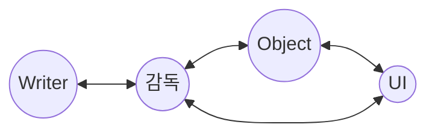

문서정보 : 2023.02.02. 작성, 작성자 [@SAgiKPJH](https://github.com/SAgiKPJH)

 

# WhyWay_Game
C# Unity로 만든 공포게임 저장소

### 목표
- [ ] 1. WhyWay 개요
  - [ ] 개요
  - [ ] 요구사항
  - [ ] 요구사항 총족을 위한 기술적 내용
- [ ] 2. WhyWay 설계
  - [ ] 개발 환경 설계
  - [ ] 개발 구조 설계
  - [ ] 개발 일정 구성
- [ ] 3. WhyWay 기본 구축
- [ ] 4. WhyWay 개발

기타 교육
- [ ] : [목적 이외의 목표1](목표이외 1 사이트)

### 제작자
[@SAgiKPJH](https://github.com/SAgiKPJH)

---

# 1. 개요

## 1-1 WhyWay 개요

컴퓨터 프로그램에는 목적에 도움이 되는 프로그램들이 존재한다. 간단하게는 계산기, 크게는 인공지능 학습등 컴퓨터 연산을 활용해 인간이 하기 오래걸리는 일들을 빠르게 처리해준다.  
이중 "즐거움"을 채워주는 목적인 게임또한 존재한다.  
게임을 프로그래밍하는 것은 기존의 프로그램들과 방식이 약간 다를 수 있는데, 지금 현재 자신이 만들어낼 수 있는 최대한의 퍼포먼스를 내고, 발전하기 위해서 제작을 결심하였다.  
무엇보다 예전부터 만들고 싶어했던 공포게임을 만들어보고, 나의 "즐거움"을 채우기 위해 제작하고자 한다.  
이 게임제작을 통해, 다른 게임제작의 기반을 마련할 것이며 분석/설계/개발/테스트/배포를 통해 개발자로서 성장할 것으로 기대한다.
  

## 1-2 요구사항

- 3D 게임이다.
- Git을 활용한 코드관리.
- 코드가 매우 직관성 있어야 한다.
  - 예
    '''cs
    Player.Create();
    UI.mode = "Chapter 01"
    '''
- 테스트 코드가 작성되어야 한다.

## 1-3 요구사항 총족을 위한 기술적 내용

- 최적화 고려
- Git을 활용한 코드관리
- 품질관리를 위한 Test 코드
- 쉬운 유지보수, 인수인계를 위한 직관적인 코드 구조

   

# 2. WhyWay 설계

## 2-1 개발 환경

### 개발 언어
- C#

### 개발 툴
- Unity
- Visual Studio 2022

### Test
- xUnit
- FluentAssertion
  
 

## 2-2 WhyWay 구조 설계

- 감독(Director)
- 배우(Actor)
- UI
- User

 

## 2-3 프로젝트 관리 설계

### 관리 툴

- Git
- Git Hub
- Git Fork

### Git repository 구성
- / : README.md을 배치
- /Doc : [문서].md를 배치
- /WhyWay : 프로젝트 폴더
- /Presentation : PPT 등을 배치

### Git Branch 구성

- main : Release 배포, README.md 문서 (public)
- Develop : 개발 통합 (private)
- Feature(n) : 기능 구현 (private)
- Release : 배포용, 모든 개발 결과가 이곳에 저장 (private)
- Test : Test 공간 (private)

 

## 2-4 프로젝트 구조 설계

### 구조 적용
- 에디터 스크립트를 통해 적용한다.

### 구조 설계
- *Editor : 유니티에 포함된 에디터 기능을 확장하기 위한 스크립터 저장
- *Resorces : 게임 프로그램 외부 파일 로드 폴더
- *Plugins : 아이폰, 안드로이드등 플랫폼으로 동작할 때 필요한 네이티브 플러그인을 저장
- Asset
  - Art
    - Materials
    - Models
    - Textures
  - Animation
    - Animators
    - AnimationClips
  - Audio
    - Music
    - Sound
  - Code
    - Scripts
      - Director
      - Ator
      - UI
      - Common
      - Tests
    - Shaders
  - Docs
  - Level
    - Prefabs
    - Scenes
    - UI
- Logs
- Library
- Pakages
- Project Setting : Unity Project 설정 파일 포함된 폴더

### 참조

- [[Unity] 유니티 프로젝트를 구성하기 위한 방법](https://velog.io/@jaehyeoksong0/unity-organizing-your-project)
- [Projecr Structure (Unity Project 구조 및 모범 사례](https://drehzr.tistory.com/1306)
- [(Unity) 유니티 프로젝트 폴더구조](https://gnam.tistory.com/8)

 

# 2-5 일정 설계

### 6개월 (대략) (4W = 1M)
- (2W) 개요 작성       (2023.02.02.~02.16.)
- (1M) 설계            (
- (1M) 개발
- (2W) 추가 설계
- (2W) 추가 개발
- (1M) Test 및 개선
- (2W) 최종 Test
- (1W) 배포 준비 및 출시

 

# 3. [] 기본 구축

## 3-1 기본 구축

### 프로젝트 구축
